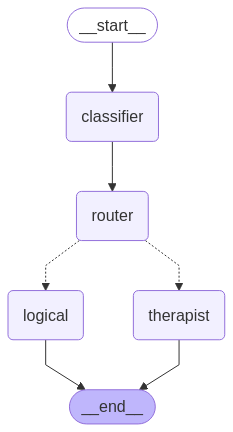

# 🧠 Emotion-Aware Chatbot with LangGraph & LangChain

This repository contains an **adaptive chatbot** built with [`LangGraph`](https://python.langgraph.dev/) and [`LangChain`](https://www.langchain.com/), designed to route user messages to different agents depending on whether they require **emotional** or **logical** responses.

---

## 🚀 Key Features

- **Message Classification** using `function_calling` and `pydantic` output schema  
- **Dynamic Routing**: classifies each user message as `emotional` or `logical`  
- **Therapist Agent**: provides empathetic and emotionally sensitive responses  
- **Logical Agent**: responds strictly with facts and logic  
- Fully interactive command-line interface  
- Built with OpenAI's `gpt-3.5-turbo`  

---

## ⚙️ How It Works

1. **User sends a message**  
2. **Classifier Node**: determines if it's `emotional` or `logical`  
3. **Router Node**: sends the message to the appropriate agent  
4. **Therapist Agent**: offers empathy and reflection  
5. **Logical Agent**: delivers factual, emotionless answers  

---

## 🧪 Example

```bash
Message: I feel like I’ve lost all direction in life.
Assistant: That sounds incredibly difficult. It's okay to feel lost sometimes...
```

---

<p align="center">  </p>

---
